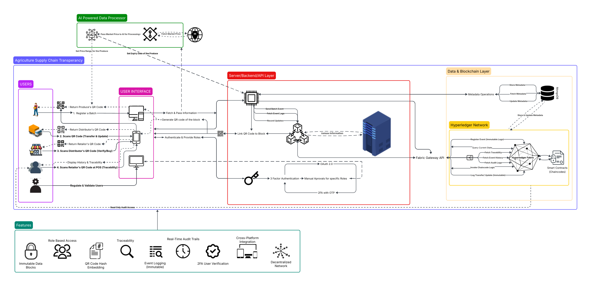

# Agriculture Supply Chain Transparency Platform

A comprehensive blockchain-based solution using Hyperledger Fabric to ensure transparency and traceability in the agricultural supply chain, featuring QR-based tracking, farmer empowerment, and verifiable proof of origin for consumers.

## System Diagram



## Overview

This platform provides end-to-end transparency in the agricultural supply chain, connecting farmers, distributors, and consumers through blockchain technology. Built with Hyperledger Fabric, IPFS storage, and modern mobile/web applications.

## Key Features

- **Blockchain Traceability**: Immutable records from farm to consumer
- **Mobile QR Scanning**: Easy product verification for farmers and consumers  
- **Web Dashboard**: Comprehensive admin panel for distributors
- **Digital Certificates**: IPFS-stored organic and quality certifications
- **Real-time Tracking**: Live supply chain monitoring and updates
- **Secure Authentication**: Multi-level access control and permissions

## Architecture

```
┌─────────────────┐    ┌─────────────────┐    ┌─────────────────┐
│   Mobile App    │    │  Web Dashboard  │    │  Backend API    │
│   (Flutter)     │◄──►│   (React.js)    │◄──►│   (Node.js)     │
└─────────────────┘    └─────────────────┘    └─────────────────┘
                                                        │
                                                        ▼
┌─────────────────┐    ┌─────────────────┐    ┌─────────────────┐
│  IPFS Storage   │◄──►│ Hyperledger     │    │   Certificate   │
│  (Documents)    │    │   Fabric        │◄──►│   Management    │
└─────────────────┘    └─────────────────┘    └─────────────────┘
```

## Quick Start

### Prerequisites
- Docker & Docker Compose
- Node.js 18+
- Go 1.21+
- Flutter 3.x

### Installation
```bash
git clone https://github.com/tanmay-mevada/Agriculture-Supply-Chain-Transparency-.git
cd Agriculture-Supply-Chain-Transparency-

# Start the blockchain network
cd deployment/docker-compose
docker-compose up -d

# Install and start backend
cd ../../backend && npm install && npm start

# Install and start web dashboard  
cd ../web && npm install && npm start

# Run mobile app
cd ../mobile && flutter pub get && flutter run
```

## Project Structure

- **`contracts/`** - Go smart contracts for Hyperledger Fabric
- **`mobile/`** - Flutter app for farmers and consumers
- **`web/`** - React.js dashboard for distributors and admins  
- **`backend/`** - Node.js API connecting apps to blockchain
- **`storage/`** - IPFS service for certificates and documents
- **`deployment/`** - Docker and cloud deployment configurations
- **`docs/`** - Comprehensive documentation and guides

## Technology Stack

| Component | Technology | Purpose |
|-----------|------------|---------|
| Blockchain | Hyperledger Fabric | Distributed ledger |
| Smart Contracts | Go | Business logic |
| Backend API | Node.js + Express | API server |
| Web Dashboard | React.js | Admin interface |
| Mobile App | Flutter | Farmer/Consumer app |
| Storage | IPFS | Document storage |
| Database | CouchDB | World state |
| Deployment | Docker + K8s | Containerization |

## Documentation

- **[Setup Guide](docs/setup/SETUP.md)** - Detailed installation instructions
- **[Architecture Guide](docs/architecture/README.md)** - System design and components
- **[API Documentation](docs/api/README.md)** - REST API reference
- **[User Guide](docs/guides/README.md)** - End-user documentation
- **[Deployment Guide](docs/deployment/README.md)** - Production deployment

## Contributing

1. Fork the repository
2. Create a feature branch (`git checkout -b feature/amazing-feature`)
3. Commit your changes (`git commit -m 'Add amazing feature'`)
4. Push to the branch (`git push origin feature/amazing-feature`)
5. Open a Pull Request

## License

This project is licensed under the MIT License - see the [LICENSE](LICENSE) file for details.

## Acknowledgments

- Hyperledger Fabric community
- IPFS team  
- Flutter and React.js communities
- Open source contributors
